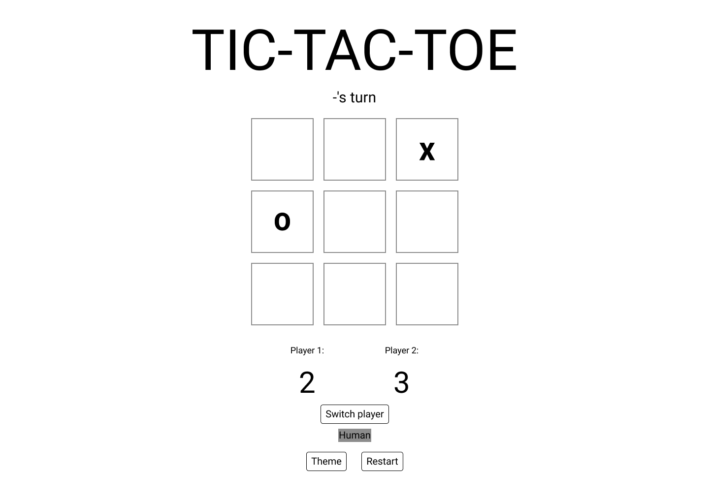
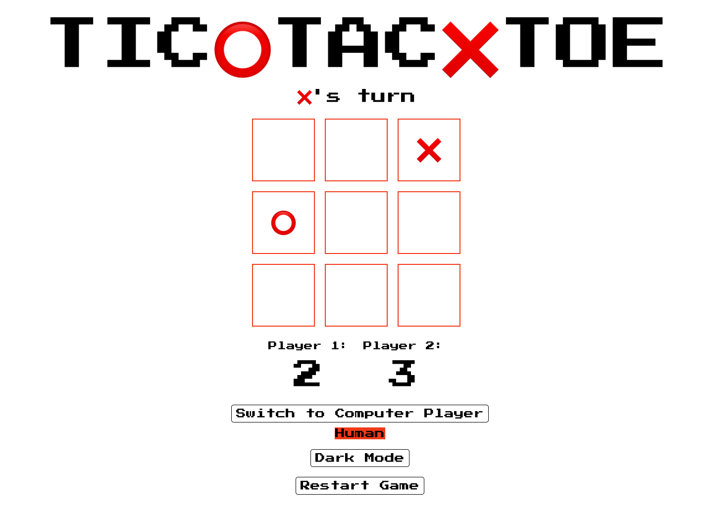

# Tic❌Tac⭕Toe #
## <u>Description</u> ##

Hey there! I'm excited to share with you my latest project: a fun and interactive Tic-Tac-Toe game built using HTML, CSS, and JavaScript.

The game is really simple yet engaging. It's played on a 3x3 grid with ❌'s and ⭕'s as players. Each player takes turns marking spaces on the board until one of them gets three of their marks in a row, column, or diagonal, and wins the game. If all the squares are filled and no winner is declared, the game ends in a tie.

I've added some really cool features to the game, including a switch to toggle between playing against a human or a computer, a score tracker, and even a dark mode feature!

When you start the game, you'll see the message "❌'s turn" displayed on the screen, indicating that it's the first player's turn. You simply click on a square on the board to place your mark, and the game checks for a winner after each turn.

One of the best features of the game is the switch that allows you to toggle between playing against a human or a computer. By default, the game starts in human vs. human mode. But, if you want to challenge yourself against a computer player, simply click the "Switch to Computer Player" button and the game will switch to computer vs. human mode. The computer player's moves are generated using a simple algorithm.

To make the game even more exciting, I've included a score tracker to keep track of the scores of both players. The first player to win five games is declared the overall winner. And, if you're like me and prefer a darker color scheme, you'll love the dark mode theme that's also included in the game.

I've added comments throughout the code to explain the different sections of the code and provide details about how the different features of the game work. I hope you have as much fun playing this game as I did building it!

## <u>Deployment link</u> ##
The project is now live on GitHub Pages and can be accessed without any specific requirements.
<li>Git repository: <MARK>ADD LINK HERE!</MARK></li>
<li>Tic-Tac-Toe Project: <MARK>ADD LINK HERE!</MARK></li>

## <u>Installation</u> ##
You don't need to install anything to play this game. All you need is a web browser that supports JavaScript and an internet connection.

## <u>Technologies used</u> ##
<li>JavaScript</li>
<li>HTML</li>
<li>CSS</li>


# <u>Planning</u> #
Before jumping into the design of my project, I decided to take some time to plan it out properly. I wanted to make sure that I had a clear vision of what the finished product would look like. So, I started by sketching out a rough, low-tech version of the design, also known as a low-fidelity wireframe. This helped me get a better idea of the overall layout and structure of the game.

After getting a better idea of what I wanted, I then created a more detailed, high-fidelity wireframe. This allowed me to get a better sense of how the game would function, and also helped me to identify any potential problems or issues that I might encounter down the line.

In addition to creating wireframes, I also wrote some pseudocode to help me better understand how the game logic would work. This was a great way to map out the various components and functions of the game, and also helped me to stay organized throughout the development process.

## <u>Pseudocode</u> ##
Check out the pseudocode I've prepared for my project!

```js
// Set up the game
set current player to X
set human opponent to true
set computer opponent to false
set player score to 0
set computer score to 0
create a 3x3 board

// Game loop
while true:

  // Print the current score
  print "Current score: Player: " + player score + " Computer: " + computer score

  // Print the board
  print board

  // Check if a player has won
  if board has a winning row or column or diagonal:
    if current player is X:
      increment player score
    else:
      increment computer score
    print current player + " wins!"
    if player score or computer score is 5:
      print "Game over!"
      break
    else:
      reset the board

  // Check for a tie
  if board is full:
    print "Tie game!"
    reset the board

  // Ask the current player for their move
  if current player is X:
    print "Player's turn"
    get players move
  else:
    print "Computer's turn"
    get computers move

  // Update the board with the current player's move
  update board with current players move

  // Switch to the other player
  if current player is X:
    set current player to O
  else:
    set current player to X
```
## <u>Wireframes</u> ##
Check out the wireframes I've created for my project!
### <u>Low fidelity wireframe:</u> ###

### <u>High fidelity wireframes:</u> ###



# <u>Build process</u> #
## <u>Variables and Elements</u> ##
At the top of the JavaScript code, I have defined some important variables and elements that I will need to use throughout the game.

First, I have a variable called "isHuman" which will help me keep track of whether the current player is a human or a computer. This will be important later on when I am coding the logic for the computer player.
```js
let isHuman = true; // Flag to determine if the current player is human or computer
```
Next, I have a variable called "gameOver" which will tell me whether the game has ended or not. If the game is over, I will need to disable certain buttons and prevent the user from making any more moves.
```js
let gameOver = false; // Flag to determine if the game is over
```
I have also stored some important elements from the HTML document, such as the body element, the button to switch between human and computer players, the element that displays the current player, the individual squares on the game board, and an element that displays messages to the user.
```js
const body = document.body; // The body element of the HTML document
const switchPlayerButton = document.getElementById("switchPlayerButton"); // Button to switch between human and computer players
const playerState = document.getElementById("playerState"); // Element that displays the current player
const squares = document.querySelectorAll(".square"); // All the individual squares on the game board
const message = document.getElementById("message"); // Element that displays messages to the user
```
Additionally, there is a button to toggle the theme, a button to restart the game, a winning score threshold, and elements that will display the scores for each player.
```js
const changeThemeButton = document.getElementById("change-theme"); // Button to toggle the theme
const winningScore = 5; // Set winning score threshold
const player1ScoreElement = document.getElementById("player1-score"); // Get player 1 score element
const player2ScoreElement = document.getElementById("player2-score"); // Get player 2 score element
```
Overall, these variables and elements will be important in keeping track of the state of the game and allowing the user to interact with the game board.


## <u>The game board</u> ##
When I set out to create my Tic Tac Toe game using HTML, CSS, and JavaScript, the first thing I did was think about how I wanted the game to look and feel. I played around with different layouts and color combinations until I found one that was visually appealing and easy to use.

Once I had a basic idea of what I wanted the game to look like, I started building the HTML structure of the game board. I created a 3x3 grid of squares using div elements. The HTML code I used looks like this:
```js
<div class="board">
        <div class="row">
          <div class="square"></div>
          <div class="square"></div>
          <div class="square"></div>
        </div>
      <div class="row">
          <div class="square"></div>
          <div class="square"></div>
          <div class="square"></div>
        </div>
      <div class="row">
          <div class="square"></div>
          <div class="square"></div>
          <div class="square"></div>
        </div>
    </div>
```

### <u>Defining variables</u> ###
At the top of the JavaScript code, I have defined some important variables and elements that I will need to use throughout the game.


### <u>Winning conditions:</u> ###
For my Tic Tac Toe game, I started by writing some JavaScript code to set up the initial game board. First, I set the initial player as "❌", which is the symbol for the first player. Then, I created an empty game board using an array called "gameBoard". This game board has 9 squares, and each square is represented by an element in the array. At the beginning of the game, all of the squares are empty, waiting to be filled by the players' moves.
```js
let currentPlayer = "❌"; // Set initial player
let gameBoard = ["", "", "", "", "", "", "", "", ""]; // Initialize empty game board
```
Next, the code creates a list of all the possible ways to win the game. This list includes all of the rows, columns, and diagonals that can be filled to win the game.
```js
const winPatterns = [ // Set possible win patterns
// Rows
  [0, 1, 2],
  [3, 4, 5],
  [6, 7, 8],
// Columns
  [0, 3, 6],
  [1, 4, 7],
  [2, 5, 8],
//Diagonals
  [0, 4, 8],
  [2, 4, 6]
];
```
Finally, the code initializes variables to keep track of each player's score. The variables "player1Score" and "player2Score" start at 0, and they'll be updated as the players win games throughout the course of the game.
```js
// Initialize score variables 
let player1Score = 0; // Set initial score for player 1
let player2Score = 0; // Set initial score for player 2
```
Overall, this code sets up the basic structure of the game, including the game board, win patterns, and player scores.
## <u>Creating the functions</u> ##
If you're looking to have a blast playing Tic Tac Toe, you'll want to create some awesome functions that make the game run like a well-oiled machine! Think of these functions as your trusty sidekicks, helping you validate player moves, checking for epic wins or losses, and updating the game board in real-time. With these functions at your disposal, you can sit back, relax, and focus on showing off your Tic Tac Toe skills.
### <u>``updateScore()`` functionality:</u> ###
This code is a function that is used to update the scores of players in a tic tac toe game. It's a bit like a calculator that keeps track of how many points each player has scored.
```js
// Function to update score
function updateScore() {
  player1ScoreElement.textContent = player1Score; // Update player 1's score display
  player2ScoreElement.textContent = player2Score; // Update player 2's score display
}
```
When the function is called, it updates the scores of both player 1 and player 2 on the screen, so everyone can see how many points each player has.

To show the scores on the screen, the code uses some special elements in HTML. These elements are like boxes where the scores can be displayed. The function updates the text inside these boxes to show the current scores.

So, if one player scores a point, the function can be called to update the scores on the screen, and everyone can see who is winning the game!
### <u>``checkWin()`` functionality:</u> ###
This next bit of code is a fantastic function that checks if a player has won the Tic Tac Toe game! It's like having your own personal referee to make sure everything is fair and square.

The function loops through all the possible winning patterns to see if any of them match the current game board state. If a player has won, the function adds a point to their score, displays a winning message, and starts a new game with a clean slate.
```js
// Function to check if a player has won
function checkWin() {
  for (let i = 0; i < winPatterns.length; i++) { // Loop through the win patterns array
    const [a, b, c] = winPatterns[i]; // Get the three indexes for the current win pattern
    if (gameBoard[a] !== "" && gameBoard[a] === gameBoard[b] && gameBoard[a] === gameBoard[c]) { // Check if the current win pattern matches the current game board state

    // Add a point to the current player's score
      if (currentPlayer === "❌") {
        player1Score++;
      } else {
        player2Score++;
      }

    // Update the score display
      updateScore();


    // Check if the game has been won
      if (player1Score === winningScore) { // Check if player 1 has won
        gameOver = true;
        message.textContent = `❌ has won the game!`; // Set the message text
        return true;
      } else if (player2Score === winningScore) { // Check if player 2 has won
        gameOver = true;
        message.textContent = `⭕ has won the game!`; // Set the message text
        return true;
      }


      // Reset the game board and start a new game
        gameBoard = ["", "", "", "", "", "", "", "", ""]; // Reset the game board
        squares.forEach(square => square.textContent = ""); // Clear the board display
        currentPlayer = "❌"; // Set the current player to X
        message.textContent = `${currentPlayer}'s turn`; // Set the message text
        return false;
      }
    }
```
If no player has won yet, the function checks if the game board is full to see if it's a tie. If it's a tie, the function displays a message and starts a new match.
```js
// Check if the game is a tie
  if (!gameBoard.includes("")) { // Check if the board is full
    gameOver = true; // Set the game over flag
    message.textContent = "It's a tie!"; // Set the message text


  // Reset the game board and start a new game
    gameBoard = ["", "", "", "", "", "", "", "", ""]; // Reset the game board
    squares.forEach(square => square.textContent = ""); // Clear the board display
    currentPlayer = "❌"; // Set the current player to X
    message.textContent = `${currentPlayer}'s turn`; // Set the message text
    return false;
  }
  return false;
}
```
Regardless of whether it's a win or a tie, the function always resets the game board, clears the display, and starts a fresh match. This way, you can always enjoy a fair game of Tic Tac Toe!
### <u>``handleClick()`` functionality:</u> ###
This function is called handleClick, which is responsible for handling what happens when the user clicks on a square in the game board. It takes in an index parameter, which tells us which square was clicked.
```js
function handleClick(index) {
```
Inside the function, we check if the game is not over and if the clicked square is empty. If both conditions are true, we update the game board array with the current player's symbol and update the text content of the clicked square with the same symbol.
```js
if (!gameOver && gameBoard[index] === "") { // Check if game is not over and the current square is empty
    gameBoard[index] = currentPlayer; // Set the current player's symbol in the gameBoard array
    squares[index].textContent = currentPlayer; // Update the square's text content with the current player's symbol
```
Inside the function, we check if the game is not over and if the clicked square is empty. If both conditions are true, we update the game board array with the current player's symbol and update the text content of the clicked square with the same symbol.
```js
if (checkWin()) { // Check if the current player has won
      return; // If they have, exit the function
    }
    currentPlayer = currentPlayer === "❌" ? "⭕" : "❌"; // Switch to the other player's turn
    message.textContent = `${currentPlayer}'s turn`; // Update the message to show whose turn it is
```
If the current player is the computer and it's their turn, we find all the available moves (empty squares) left on the game board and choose a random move by generating a random index. We then call handleClick again with the randomly chosen square.
```js
if (!isHuman && currentPlayer === "⭕") { // If the current player is the computer and it's their turn
      // Find all the available moves (empty squares) left on the game board
      const availableMoves = gameBoard.reduce((acc, curr, index) => {
        if (curr === "") {
          acc.push(index);
        }
        return acc;
      }, []);
      // Generate a random index to choose a random move
      const randomIndex = Math.floor(Math.random() * availableMoves.length);
      // Call handleClick() with a random available square
      handleClick(availableMoves[randomIndex]);
    }
  }
}
```
Lastly, we add event listeners to each square on the game board using a forEach loop. When a square is clicked, it calls the handleClick function with the index of the clicked square.
```js
// Add event listeners to the game board squares
squares.forEach((square, index) => {
  square.addEventListener("click", () => handleClick(index));
});
```
### <u> Change opponent button functionality</u> ###

Here we have a piece of code that adds an event listener to the "switchPlayerButton" element. This is a fancy way of saying that we're setting up the button to "listen" for when a player clicks on it.
By adding this event listener to the "switchPlayerButton" element, we've essentially given the button the power to switch between human and computer opponents. So now, with just one click of the button, players can switch up their opponent and keep the game exciting and fresh!
```js
switchPlayerButton.addEventListener('click', () => {
```
When the button is clicked, the code inside the curly braces will run. The first thing that happens is that the value of "isHuman" is switched. "isHuman" keeps track of which player is currently taking a turn. By switching the value of "isHuman", we're changing which player is currently taking a turn. If "isHuman" is currently true, it will become false, and vice versa.
```js
isHuman = !isHuman; // Switches the value of isHuman to change the current player
```
And next we have a line of code that updates the text inside the "playerState" element.
```js
playerState.innerHTML = isHuman ? '<strong>Human</strong>' : '<strong>Computer</strong>';
});
```

### <u>Theme button functionality</u> ###
 The first line of code creates a variable called "isDarkMode" and sets it to false. This variable will be used to keep track of whether the current theme is dark or light.
 ```js
let isDarkMode = false; // Flag to determine the current theme
 ```
The upcoming section of the code is where the real excitement begins! Here, we're attaching an event listener to the "changeThemeButton" element. This means that when a player clicks on this button, our game will get even more interesting!
```js
changeThemeButton.addEventListener('click', () => {
```
Inside the event listener, we have some code that selects a random audio file from an array called "audioFiles". This will add some fun sound effects to our game!
```js
// Get a random audio file index
const randomIndex = Math.floor(Math.random() * audioFiles.length);
```
Next, we create a new audio element and play the selected audio file. This will make our game even more exciting and engaging for the players.
```js
// Create a new audio element
  const audio = new Audio(audioFiles[randomIndex]);
  
// Play the audio
  audio.play();
```
Now, here's where things get really interesting. We have an if/else statement that checks the value of "isDarkMode". If it's true, that means the current theme is dark, and we need to switch it to light. So, we remove the "dark" class from the "body" element and add the "light" class. We also change the text content of the "changeThemeButton" element to say "Dark Mode".
```js
// If the current theme is dark, switch to light
  if (isDarkMode) {
    body.classList.remove('dark');
    body.classList.add('light');
    changeThemeButton.textContent = "Dark Mode";
  }
```
On the other hand, if "isDarkMode" is false, that means the current theme is light, and we need to switch it to dark. So, we remove the "light" class from the "body" element and add the "dark" class. We also change the text content of the "changeThemeButton" element to say "Light Mode".
```js
// If the current theme is light, switch to dark
  else {
    body.classList.remove('light');
    body.classList.add('dark');
    changeThemeButton.textContent = "Light Mode";
  }
```
Finally, we flip the value of "isDarkMode" using the "!" (not) operator, which means that the next time the player clicks on the button, the opposite theme will be applied. How cool is that? With this code, we've made our game even more engaging and interactive for the players. Let's go play some tic tac toe!
```js
isDarkMode = !isDarkMode; // Flip the isDarkMode flag
});
```
### <u>Restart button functionality</u> ###
This part is where we define a function called "resetGame". This function does exactly what it says: it resets the game and scores. It sets the current player to "❌", clears the game board, and resets the message to display whose turn it is. It also resets the scores for both players and updates the score display.
```js
function resetGame() {
  currentPlayer = "❌";
  gameBoard = ["", "", "", "", "", "", "", "", ""];
  squares.forEach(square => square.textContent = "");
  message.textContent = `${currentPlayer}'s turn`;
  gameOver = false;
  player1Score = 0; // reset player 1 score
  player2Score = 0; // reset player 2 score
  updateScore(); // update score display
}
```
We also have an event listener attached to the "restartButton".
```js
// Add event listener to restart button
restartButton.addEventListener("click", resetGame);
```
When the player clicks on this button, the resetGame function gets called and everything is reset to the beginning. This way, players can start a new game whenever they want.
### <u>Audio functionality</u> ###
This line declares a constant variable named "audioFiles" and initializes it to an array of six strings. Each string represents the filename of an audio file.
```js
const audioFiles = [ // Create an array of audio files
  'btton-1.mp3',
  'btton-2.mp3',
  'btton-3.mp3',
  'btton-4.mp3',
  'btton-5.mp3',
  'btton-6.mp3',
];

```
Using the document.getElementById() method, we select an HTML element with an ID of "switchPlayerButton". This element is then assigned to a constant variable named "button", allowing us to reference it later in the code.
```js
// Get the button element
const button = document.getElementById('switchPlayerButton');
```
This piece of code sets up an event listener for the "button" element. Specifically, it listens for a "click" event on the button. When the user clicks the button, the function inside the parentheses is called and executed.
```js
// Add an event listener to the button
  button.addEventListener('click', () => {
```
The following code creates a constant variable called "randomIndex" and assigns it a random integer value. The value is generated using the Math.random() method, and it falls within the range of 0 (inclusive) and the length of the "audioFiles" array (exclusive). This means that the variable "randomIndex" will be a valid index value that can be used to access an element in the "audioFiles" array.
```js
// Get a random audio file index
  const randomIndex = Math.floor(Math.random() * audioFiles.length);
```
This code creates an Audio object and assigns it to the constant variable called "audio". The Audio object is created using the file name of an audio file that is randomly selected from the "audioFiles" array.
```js
// Create a new audio element
  const audio = new Audio(audioFiles[randomIndex]);
```
This line calls the play() method on the "audio" object, which starts playing the audio file.
```js
// Play the audio
  audio.play();
});
```

### <u>Bugs</u> ###
<li>The last token placed before a win doesnt display.</li>
<li>After first round win, the first turn goes to ⭕, and doesnt change after each round.</li>
<li>Game freezes with a tie.</li>

### <u>Wins</u> ###
<li>I think it looks great</li>
<li>I really enjoyed tidying everthing up, making the code look nice also.</li>
<li>It works well with different screensizes</li>

### <u>Key Learnings</u> ###
<li>My comprehension of both JavaScript and CSS has significantly increased.</li>
<li>I have more confidence in myself</li>
<li>Pseudocode is alot more useful than I expected</li>

### <u>Future improvements</u> ###
<li>Implement more sounds.</li>
<li>Add more animations.</li>
<li>Harder AI opponent (better alogorithm).</li>
<li>Make the winning game notification more exciting.</li>